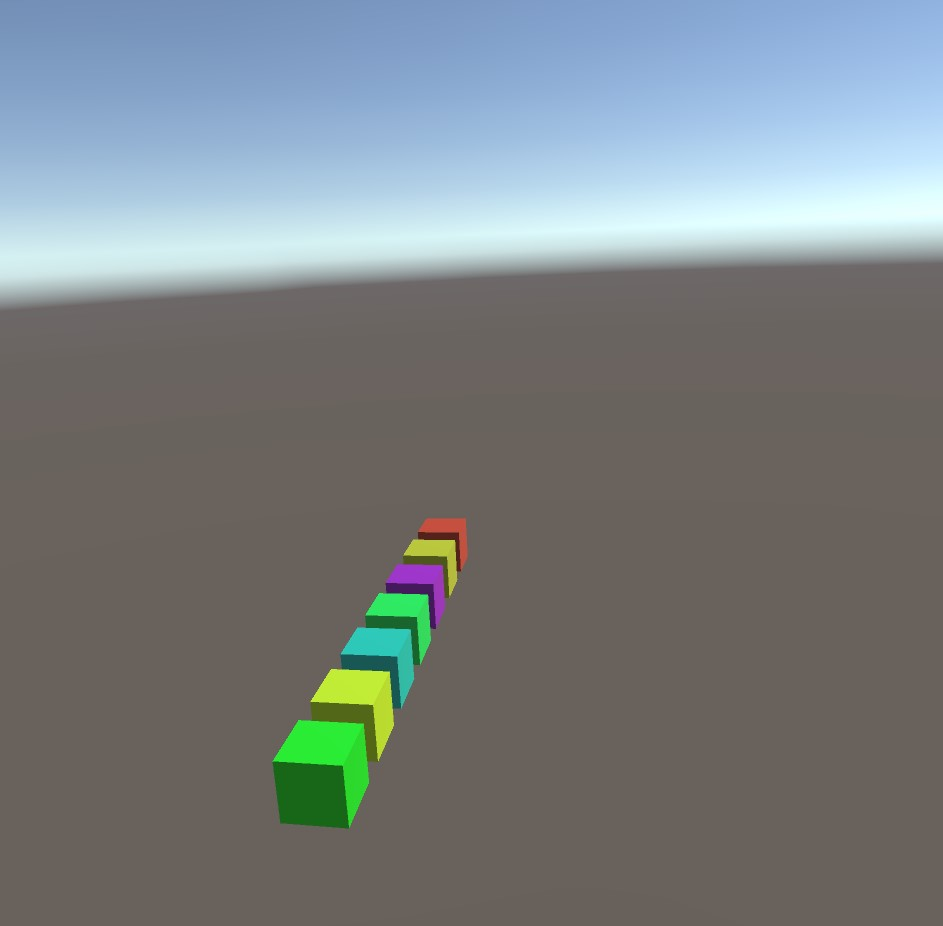
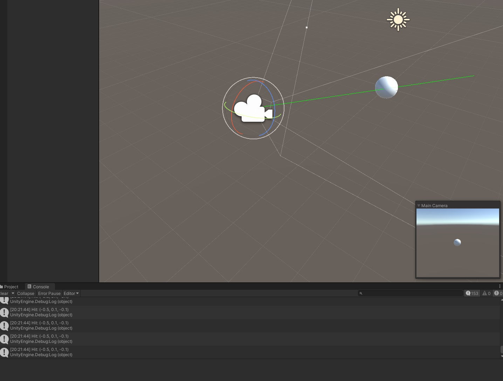
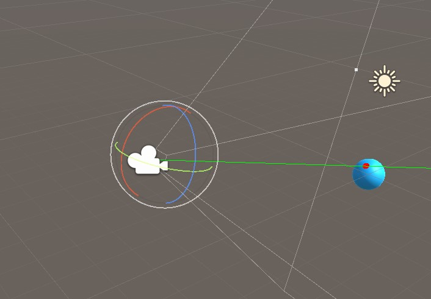

# Unity3D VR - Scripting
Learning C# by Unity3D scripting lecture

## Exercise Part 1: C# and Coroutines

### Aim
▪ Use fields, references, public, private, lists, instantiate,
frame update times

### Goal
▪ Instantiate a total of [x] game objects (e.g., cubes)

▪ [x] is configurable in the Unity editor

▪ Create a new cube prefab instance after a random amount of time passed. Apply a random color.
You can store a target time in a variable and check if it’s reached in Update() (or use Invoke() )

▪ Fade the game object in by modifying its alpha with a coroutine.
Make sure you use a material / shader that supports transparency. Choose one of the two variants:

1. Use yield return new WaitForSeconds(.05f)
   
2. Use Time.deltaTime & yield return null for a smooth fade in that updates every frame

### Solution
Added a Fader script with a variable duation to the cube. The script _WorldManagement.cs_ in the EventSystem, 
adds the logic for the cube creation.

## Exercise Part 2: Gaze & Events

### Aim
▪ Use events, perform raycast, trigger change

### Goal
▪ Extend previous exercise: gazing on an object changes its color
▪ When gazed on, store its color. Replace it with highlight color.
▪ Restore original color on GazeOut.

### Sources
* [Unity + C# - Events and Delegates Explained](https://www.youtube.com/watch?v=ihIOVj9t0_E&ab_channel=UnityChat)
* [C# Events](https://docs.microsoft.com/en-us/dotnet/csharp/events-overview)
* [VR Dev](https://www.coursera.org/learn/mobile-vr-app-development-unity/)

## Exercise Part 3: Reticle / Cursor

### Aim
▪ Using canvas, dynamic positioning of items in scene according to gaze

### Goal
* Add a reticle to your scene
  * Rotate it according to the hit surface normal
  * Scale with distance from camera
  * Use default distance if no hit
* Position reticle in Update() / PerformEyeRaycast() in EyeRaycast.cs

## License
[MIT](https://choosealicense.com/licenses/mit/)
